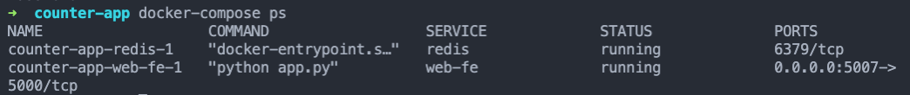
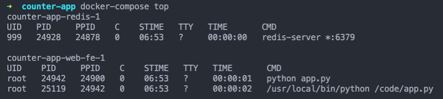

## Overview

Docker Compose deploys and manages *multi-container applications* (microservices) on Docker nodes running in **single-engine** mode.

In contrast, Docker Swarm deploys and manages multi-container apps on Docker nodes running in **swarm mode**.

Docker Compose allows you to describe an entire app in a single declarative configuration file and deploy it with a single command. In other words, include all your run commands in one file, rather than having to enter them each time you run a container. 

This is much more convenient than setting up VMs with Vagrant. For example, to test an app, you'd just need to:

- clone a git repo (containing a Dockerfile and a docker-compose.yml)
- run `docker-compose up`

Then you have access to everything without having to install and configure databases.

Once the app is deployed, you can manage its entire lifecycle with a simple set of commands. And the configuration file can be stored in a VCS.

To check Docker Compose is installed, run: `docker-compose --version`. It should be installed by default with Docker Desktop on Mac and Windows.

## Creating Docker Compose Files

Docker Compose uses YAML files to define multi-service applications. You can also use JSON.

The default name for a Docker Compose YAML file is `docker-compose.yml`. You can also use the `-f` flag to specify custom filenames.

Here's an example of a Docker Compose file:

``` yaml

version: "3.8"
services:
  web-fe:
    build: .
    command: python app.py
    ports:
      - target: 5000
        published: 5000
    networks:
      - counter-net
    volumes:
      - type: volume
        source: counter-vol
        target: /code
  redis:
    image: "redis:alpine"
      networks:
        counter-net

networks:
  counter-net:

volumes:
  counter-vol:

```

The `version` key is no longer mandatory, but you'll still see it around. This defines the version of the Compose file format (i.e. the API), not the version of Docker Compose or Docker Engine.

The `services` key is where you define the different application microservices. In this case, there are two microservices: `web-fe` and `redis`.

You can include a `depends_on` key to specify dependencies. For example:

``` yaml
  depends_on:
    - mysql-primary
    - mysql-secondary

```

And you can add environment variables, such as passwords:

``` yaml
  environment:
    - MYSQL_PASSWORD=password
    - POSTGRES_PASSWORD=password
```

These can also be specified in dictionary format. For example:

``` yaml
  environment:
    MYSQL_PASSWORD: password
    POSTGRES_PASSWORD: password
```

The top-level `networks` key tells Docker to create new networks. By default, Compose creates [bridge networks](./../networking/#single-host-bridge-networks). These are single-host networks that can connect only containers on the same Docker host. You can use the driver property to specify different network types. For example:

``` yaml
networks:
  over-net:
  driver: overlay
  attachable: true
```

The top-level `volumes` key is where you tell Docker to create new volumes.

In the example above, the `services` section has two second-level keys:

- web-fe
- redis

Each of these defines a service (container) in the app. Within the definition of the `web-fe` service, you give Docker the following instructions:

- `build: .` - this tells Docker to build a new image using the instructions in the Dockerfile in the current directory (.). The newly built image is used in a later stage to create the container for this service.
- `command: python app.py` - this tells Docker to run a Python app called `app.py` as the main app in the container. This can also be specified in the Dockerfile, although you can override it here in the Compose file. The `app.py` file must exist in the image, and the image must contain Python. This is handled by the Dockerfile.
- `ports:` - tells Docker to map port 5000 inside the container (`-target`) to port 5000 on the host (`published`). Traffic sent to the Docker host on port 5000 is directed to port 5000 on the container. The app inside the container listens on port 5000.
- `networks:` - tells Docker which network to attach the service's container to. The network should already exist or be defined in the `networks` top-level key. If it's an overlay network, it needs to have the `attachable` flag.
- `volumes:` - tells Docker to mount the `counter-vol` volume (source:) to /code (target:) inside the container. The `counter-vol` needs to already exist, or be define in the `volumes` top-level key at the bottom of the file.

As both services are deployed to the same `counter-net` network, they will be able to resolve each other by name.

## Deploying an App with Compose

Compose uses the name of your directory as the project name. If your directory is called `counter-app`, all resources names are prepended with `counter-app_`.

You can override the default name Compose uses. That's how you can run many copies of the same application in different sets of containers on a single Docker Engine.

The command to deploy an app is:

`docker-compose up`

You can add the `-d` flag to run the app in the background.

Once the app is built and running, you can use normal `docker` commands to view the images, containers, networks, and volumes created by Compose. For example:

- docker volume ls
- docker network ls

## Managing an App with Compose

To see the current state of the app, use `docker-compose ps`.



Use `docker-compose top` to list the processes running inside of each service (container).



To stop a Compose app, use `docker-compose stop`. This command just stops the app's containers. The application definition remains on the system.

You can restart the app with the `docker-compose restart` command.

You can delete a stopped Compose app with `docker-compose rm`. This deletes the containers and networks the app is using, but doesn't delete volumes or images.

Use the `docker-compose down` command to stop and delete the app with a single command. Then only the images, volumes, and source code remain. As the images are still present, future deployments will be faster.

If the app's code resides on a Docker volume, this means we can make changes to file in the volume from outside the container. Those changes are then reflected immediately in the app.

To remove volumes when you stop the app, use the following command:

`docker-compose down -v`

## Creating Health and Dependency Checks in Docker Compose

As with Dockerfiles, you can add healthchecks to Docker Compose files:

``` yaml
healthcheck:
  interval: 5s
  timeout: 1s 
  retries: 2
  start_period: 5s
```

- `interval` - time between checks
- `timeout` - how long the check should be allowed to run before it's considered a failure
- `retries` - number of consecutive failures allowed before the container is flagged as unhealthy
- `start_period` - amount of time to wait before triggering the health check - gives your app some startup time before health checks run.

You can also add a health check in your Compose file for containers that don’t have one declared in the image.

## Building an Image with Docker Compose

If you include a `build` key, in your docker-compose.yml file, you can build an image before running it:

``` yaml
version: '2'

services:
  frontend:
    image: my-fe
    build: .
```

In the example above, Docker checks for the image in cache. If it's not there, Docker looks for a Dockerfile in the current directory and builds the image.

To ensure any existing images are rebuilt, use:

`docker-compose up --build` (you can also specify a service name )

If you don't specify a name for your image, Docker assigns one based on your project name. In this case, you can also remove the image with the following command:

`docker-compose down --rmi local`

## Overriding docker-compose Files

If you want to get fancy, you can use a basic `docker-compose.yml` file and then override it with values in an additional file called `docker-compose.override.yml`.

Here's the basic `docker-compose.yml`:

``` yaml
version: '3.1'

services:

  drupal:
    image: drupal

  postgres:
    image: postgres
```

You can then include additional configuration with a `docker-compose.override.yml` file:

``` yaml
version: '3.1'

services:

  drupal:
    ports:
      - "8080:80"
    volumes:
      - drupal-modules:/var/www/html/modules

  postgres:
    environment:
      - POSTGRES_PASSWORD=password
```

There are no images specified in the second file - that's because they're already in the main `docker-compose.yml` file.

You could use a similar system for using different values for testing and production environments. For example, a `docker-compose.test.yml` file would use test data, rather than mounting a real volume. This would make it faster. The `docker-compose.prod.yml` then attaches the real volumes and live databases.

To run these custom files on top of the basic file, use the following format:

`docker-compose -f docker-compose.yml docker-compose.test.yml -d`

You can also view the consolidated file before you deploy it:

`docker-compose -f docker-compose.yml docker-compose.test.yml config`

To actually consolidate those two files into a new file:

`docker-compose -f docker-compose.yml docker-compose.test.yml > output.yml`

## Limitations of Docker Compose 

You get the desired state of your application when you run `docker-compose up`, but that's where Docker Compose ends. It's not a full container platform like [Docker Swarm](./../docker-swarm/) or [Kubernetes](./../kubernetes/) - it doesn't continually run to ensure your application is maintained in its desired state.

If containers fail or you remove them manually, Docker Compose won't restart or replace them until you explicitly run `docker-compose up` again.

Docker Compose is great for running containers on a single machine, but that doesn't work in a production environment. If that machine goes offline, you lose all your applications.

This is why you need an orchestrator, such as [Docker Swarm](./../docker-swarm/) or [Kubernetes](./../kubernetes/).