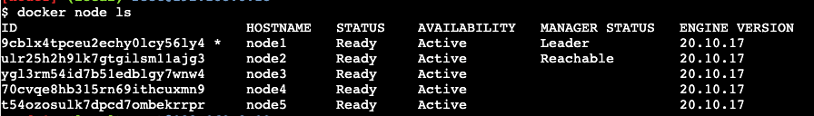

## Overview

Docker Swarm is:

- An enterprise-grade secure cluster of Docker hosts.
- An engine for orchestrating microservices apps.

Essentially it's a clustering solution built inside Docker. Swarm takes Docker beyond being just a container runtime.

Swarm groups one or more Docker nodes and lets you manage them as a cluster. You get:

- an encrypted distributed cluster store
- encrypted networks
- mutual TLS
- secure cluster join tokens
- PKI (public key infrastructure) for managing and rotating certificates

As an orchestrator, Swarm exposes a rich API to allows you to deploy and manage complex microservices apps. You define your apps in declarative manifest files and deploy them to the Swarm with Docker command. You can also perform:

- rolling updates
- rollbacks
- scaling

Docker Swarm competes directly with Kubernetes, but it's much simpler to configure and deploy.

A Swarm consists of one or more Docker *nodes*. These nodes can be physical servers, VMs, or cloud instances.

Nodes are configured as *managers* or *workers*:

- **Managers** look after the control plane.
- **Workers** accept tasks from managers and execute them.

The configuration and state of the swarm is stored in a distributed etcd database, held on all managers.

Swarm uses TLS to encrypt communications, authenticate nodes, and authorize roles. Automatic key rotation is also included.

On a Swarm, the atomic unit of scheduling is the service. This wraps some advanced features around containers, including scaling, rolling updates, and simple rollbacks.

A service is essentially an enhanced container. Whereas individual containers have their own identities, containers in a service are assigned a number based on the service name. It's like the famous computing analogy of pets vs cattle. If you have hundreds of containers (or cows), you don't want to have to shout for them by individual names.

## Creating a Swarm

To create a Swarm, use the following command:

`docker swarm init --advertise-addr <ip-address:port>`

To join a node to a Swarm, use:

`docker swarm join-token manager`

`docker swarm join-token worker`

You can then copy and paste the relevant generated token into your additional nodes.

To list the nodes in the Swarm, use:

`docker node ls`

The asterisk denotes which node you are logged into and executing commands from. Only managers can view information about the Swarm.

## Maintaining High Availability

Swarm managers include native support for high availability (HA). This means one or more nodes can fail, and the survivors keep the swarm running.

Although you have multiple managers, only one of them is *active* at any time. This active manager is called the *leader*. Only the leader issues live commands to the Swarm. This is called a*ctive-passive multi-manager HA*.

The others keep a replica of the cluster database, they can action API requests, and they can take over if the leader fails.

Managers are either leaders or followers. This is Raft terminology. It uses an implementation of the Raft consensus algorithm to maintain a consistent cluster state across multiple highly available managers.

Two best practices apply:

- Deploy an odd number of managers.
- Don't deploy too many managers (3 or 5 is recommended) - decision-making is faster!

An odd number of managers helps ensure *quorum* and avoid split-brain conditions. A swarm cluster continues to operate during split-brain conditions, but you are no longer able to alter the configuration or add and manage application workloads.

 If you permanently lose a manager node and find yourself with an even number of managers, you can promote a worker node to become a manager instead:

 `docker node promote <node-name>`

### Achieving Quorum

In a swarm of N managers, a quorum (a majority) of manager nodes must always be available. For example, in a swarm with five managers, a minimum of three must be operational and in communication with each other.

The swarm can tolerate up to (N-1)/2 permanent failures, beyond which requests involving swarm management cannot be processed. An odd number of managers is recommended because the next even number does not make the quorum easier to keep. For instance, whether you have 3 or 4 managers, you can still only lose 1 manager and maintain the quorum. If you have 5 or 6 managers, you can still only lose two.

## Locking a Swarm

Restarting an older manager or restoring an old backup has the potential to compromise the cluster.

Docker allows you to lock a swarm with the *Autolock* feature. This forces restarted managers to present the cluster unlock key before they're readmitted to the cluster.

To apply an autolock when creating a swarm:

`docker swarm init --autolock`

To autolock an existing swarm:

`docker swarm update --autolock=true`

You'll then see a key. Keep this in a safe place! Without it, the manager is unable to rejoin the swarm.

You can check your current swarm unlock key with:

`docker swarm unlock-key`

To unlock, use:

`docker swarm unlock`

Locking your swarm and protecting the unlock key is recommended for production environments.

## Backing Up a Swarm

Backing up a Swarm backs up the control plane objects required to recover the Swarm in the event of failure or corruption.

Swarm configuration and state is stored in `var/lib/docker/swarm` on every manager node. A Swarm backup is a copy of all the files in this directory.

You need to stop the Docker daemon on the node you are backing up, so it's a good idea to perform the backup from non-leader managers.

Backup process:

1. Stop Docker on a non-leader swarm manager (`service docker stop`).
2. Back up the Swarm config.
3. Verify the backup file exists.
4. Restart Docker (`service docker restart`).

## Restoring a Swarm Backup

Restoration process:

1. Restore the Swarm configuration files from the backup.
2. Start Docker (`docker service start`).
3. Initialize a new Swarm cluster. The `--force-new-cluster` flag tells Docker to create a new cluster using the configuration stored in `/var/lib/docker/swarm/` that you recovered in step 1.
4. Add new manager and worker nodes.

Note:

- You can only restore to a node running the same version of Docker the backup was performed on.
- You can only restore to a node with the same IP address as the node the backup was performed on.

## Managing Nodes

You can run `docker node inspect self` to view details on the current node.

### Draining Nodes

To drain a node (from the manager), run:

`docker node update --availability drain <node-name>`

To exclude a manager node from running the tasks of a service: `docker node update --availability drain manager`.

Drain mode means slightly different things for workers and managers. In both cases, all the replicas running on the node are shut down and no more replicas will be scheduled for the node. However,Manager nodes remain part of the management group, so they still synchronize the cluster database, provide access to the management API, and can be the leader.

Setting a node to DRAIN does not remove standalone containers from that node, such as those created with `docker run`, `docker-compose up`, or the Docker Engine API.

### Adding Node Labels

To add a label to a node, use:

`docker node update --label-add <label-name>=<label-value> <node-name>`

To view the label, use:

`docker node inspect <node-name>`

### Leaving a Swarm

To remove a worker from the Swarm, use:

`docker swarm leave`

You can add the `--force` flag to remove a manager from the Swarm. However, this doesn't reconfigure the Swarm to ensure there are enough managers to maintain quorum.

The safe way to remove a manager from the Swarm is to demote it to a worker with `docker node demote <node-name>`, then run `docker swarm leave`.

A manager can remove a node with:

`docker node rm <node-name>`

If you want to make a worker node available again, use:

`docker node update --availability active <node-name>`

