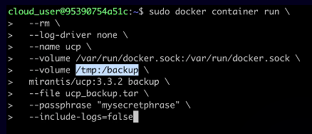

## Overview

There are two Docker editions:

- Community Edition (CE, free)
- Enterprise Edition (EE, not free)


## Docker Community Edition

This version is free for testing and development purposes. You can get Docker CE for:

- Mac
- Windows
- Linux

You can check everything is installed correctly by running the `docker version` command. This confirms the CLI can talk to the Docker Engine.

To see the Docker configuration, run `docker info`.

To configure the Docker daemon to start automatically:

- Use upstart for Ubuntu 14.10 and below.
- Use systemd for most current Linux distributions.

## Docker Enterprise Edition

Docker Enterprise Edition (EE) is now rebranded as Mirantis Kubernetes Engine (MKE).

Docker EE has three components:

- Docker EE
- UCP (Universal Control Plane)
- DTR (Docker Trusted Registry)

You interact with the UCP, rather than directly with Docker EE.

The UCP is a container that you run from an image.

You cannot install the DTR on the same node as the UCP. Therefore, your Swarm must have more than one node.

DTR doesn't manage the high availability of data. You need to use a third-party solution for DTR storage.

Fortunately, the (very tricky) installation steps aren't covered by the exam!

Using external certificates is recommended when integrating with a corporate environment. One best practice is to use the Certificate Authority for your organization. Reduce the number of certificates by adding multiple Subject Alternative Names (SANs) to a single certificate. This allows the certificate to be valid for multiple URLs.

### Docker Trusted Registry

You can install DTR on-premises or on a cloud provider. All nodes must:

- Be a worker node managed by UCP.
- Have a fixed hostname.

The `dtr-ol` network allows DTR components running on different nodes to communicate with each other.

### Interlock

UCP also provides Interlock, an integrated component for publishing applications deployed within the cluster. Based on NGINX, Interlock works with Swarm deployments, monitoring the cluster's API for changes on defined services.

We define which services are published and which headers, names, and routes should be available. All changes applied to the services are automatically populated to Interlock's reverse proxy component, which then forwards requests to the associated backends.

### Sizing Requirements

Sizing requirements *are* covered by the exam, although I have no idea why you'd ever try to memorise this information, rather than just looking it up. Anyway, here it is:

- Minimum 8Gb memory and 2 CPUs for manager modes.
- Recommended 16Gb memory and 4 CPUs for manager modes.
- Minimum 4Gb memory for worker nodes.

### Configuration of Logging Drivers

By default, Docker uses the `json-file` logging driver, which caches container logs as JSON internally.

Docker can also use other drivers, such as splunk and journald.

To configure the logging driver, run the following command:

`docker run -it --log-driver <log-driver> <image-name>`

To fetch the driver type, run:



`docker inspect -f '{{.HostConfig.LogConfig.Type}}' <container-name>`



### Configuring Docker to Start on Boot

Most current Linux distributions (RHEL, CentOS, Fedora, Debian, Ubuntu 16.04 and higher) use systemd to manage which services start when the system boots. On Debian and Ubuntu, the Docker service is configured to start on boot by default. To automatically start Docker and Containerd on boot for other distros, use the commands below:

```
 sudo systemctl enable docker.service
 sudo systemctl enable containerd.service
```

## Backing Up UCP and DTR

Here's the process for backing up UCP and DTR:

1. [Back up the Docker Swarm](./../docker-swarm/#backing-up-a-swarm)
2. Back up UCP
3. Back up DTR Images
4. Back up DTR Metadata

### Backing up UCP

This is done with the `docker/ucp` image:



**Note**: Config and secrets are not backed up when you back up UCP.

### Backing up DTR Images

Make a copy of the following directory:

`/var/lib/docker/volumes/dtr-registry`

### Backing up DTR Metadata

This is done with an image. For example:

``` bash
read -sp 'ucp password: ' UCP_PASSWORD; \
docker run --log-driver none -i --rm \
  --env UCP_PASSWORD=$UCP_PASSWORD \
  docker/dtr:2.5.3 backup \
  --ucp-url <ucp-url> \
  --ucp-insecure-tls \
  --ucp-username <ucp-username> \
  --existing-replica-id <replica-id> > dtr-metadata-backup.tar
```

This includes RBAC configuration and image signatures.

**Note**: Users, orgs, and teams are not backed up while backing up DTR.


## Installing Docker Trusted Registry (DTR)

When you install the UCP, you have access to install the DTR from the Admin Settings of the UCP.

Installation Requirements

- Minimum 16Gb memory, 2 CPUs, 10Gb disk
- Recommended 16Gb memory, 4 CPUs, 25-100Gb disk

To install the DTR, you must have at least two nodes in your cluster. It won't work if you try to install it on the same node as the UCP - they both use port 443, so you'll be unable to access the DTR.

1. On the left menu, click admin ➤ Admin Settings ➤ Docker Trusted Registry.
2. Write the IP of the second node in the DTR external URL.
3. Choose the second node in UCP node.
4. Select PEM-CA.
5. Copy the generated code.
6. docker-machine ssh <second node for DTR>
7. Then paste the generated code.
8. The DTR should be installed with TLS for the <second-node-url>.

When the DTR is successfully installed, go again to admin ➤ Admin Settings ➤ Docker Trusted Registry. It will display the IP address of the second node. Copy and paste in the browser. The DTR IP will be displayed.

The DTR installation runs the following containers:

- **dtr-garant** - manages user authentication
- **dtr-jobrunner** - executes DTR's maintenance tasks to remove unreference layers

## Troubleshooting
### Checking the UCP

You can use the `https:///_ping` endpoint to check the health of a single UCP manager node. When you access this endpoint, the UCP manager validates that all its internal components are working, and returns one of the following HTTP error codes:

- **200**, if all components are healthy
- **500**, if one or more components are unhealthy

### Starting the Docker Daemon Manually

You can start the Docker daemon manually with `dockerd`. On a typical installation, the Docker daemon is started by a system utility, not manually by a user. However, this command is useful for testing and troubleshooting.

You can configure the `dockerd` command using flags: For example, to set the DNS server for all Docker containers, use:

`dockerd -dns <ip-address>`

To specify multiple DNS servers, using multiple `-dns` flags. If the container cannot reach any of the specified IP addresses, Google's public DNS server 8.8.8.8 is added so your container can resolve internet domains.

### Setting the Docker Engine to Debug Mode

To set the Docker Engine to debug mode, use the following command:

`echo '{"debug":true}' > /etc/docker/daemon.json ; sudo kill -HUP`
