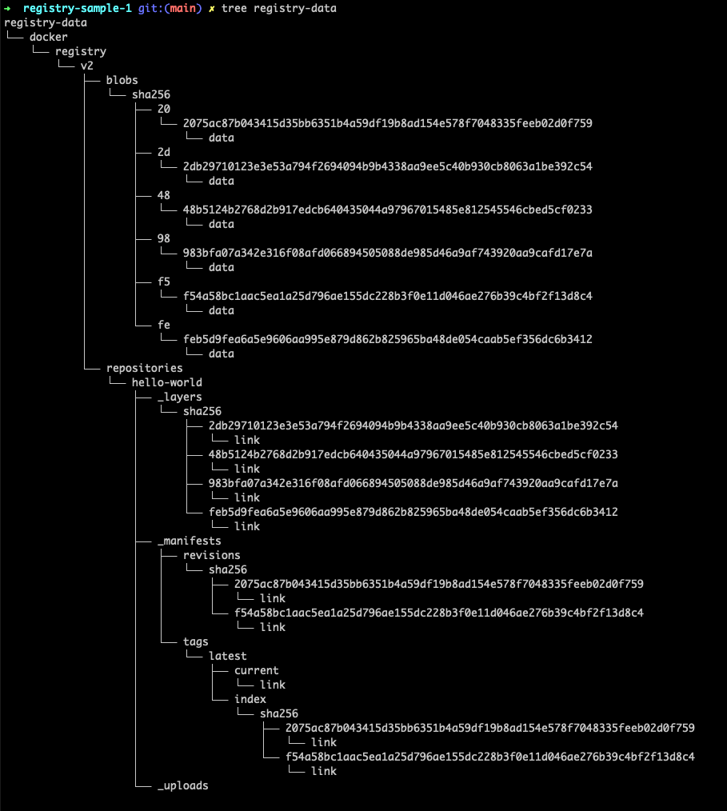

## Overview

Docker images comprise layers. Each layer is represented only once on the file system and is identified by a SHA.

### Copy-on-Write

Copy-on-write is a strategy of sharing and copying files for maximum efficiency. If a file or directory exists in a lower layer within the image, and another layer (including the writable layer) needs read access to it, it just uses the existing file. The first time another layer needs to modify the file (when building the image or running the container), the file is copied into that layer and modified. This minimizes I/O and the size of each of the subsequent layers.

## Using Registries

The local image repository on a Linux-based Docker host is usually located at `/var/lib/docker/<storage-driver>`.

You can check the contents with:

`docker image ls`

Image registries contain one or more image repositories.

Docker won't talk to any registries without HTTPS, except localhost.

If you want to use a remote self-signed TLS, you need to enable `insecure-registry` in Docker Engine.

### Searching Docker Hub from the CLI

The docker search command lets you search Docker Hub from the CLI:

`docker search nginx`

You can use a filter to ensure only official repos are displayed:

`docker search alpine --filter "is-official=true"`

## Pulling Images

To pull images, use the following command format:

`docker image pull <image-name:tag>`

If you don't specify an image tag after the repository name, Docker assumes you're referring to the image tagged as `latest`. If the repository doesn't have an image tagged as `latest`, the command fails.

If you want to pull images from third-party registries (not Docker Hub), you need to prepend the repository name with the DNS name of the registry:

`docker image pull gcr.io/google-containers/git-sync:v3.1.5`

### Pulling Images with Multiple Tags

You can pull all the images in a repository by adding the `-a` flag:

`docker image pull -a catherinepope/docker-demo`

### Pulling Images by Digest

Tags are mutable! This means it's possible to wrongly tag an image.

All images get a cryptographic content hash, also referred to as a digest. It's impossible to change the contents of the image without creating a new unique digest. Digests are immutable.

Every time you pull an image, the `docker image pull` command includes the image's digest.

You can also view the digests of your images:

`docker image ls --digests`

Once you know the digest of an image, you can use it when pulling the image again:

`docker image pull ubuntu@sha256:b6b83d3c331794420340093eb706a6f152d9c1fa51b262d9bf34594887c2c7ac`

### Pulling Multi-Architecture Images

A single image, such as `golang:latest`, can contain an image for Linux on x64, Linux on PowerPC, and Windows x64. You can run a simple `docker image pull golang:latest` from any platform and Docker pulls the correct image for your platform and architecture.

## Creating a Local Registry

This command pulls an image from Docker Hub to run a local registry:

`docker run -d -p 5000:5000 --restart=always --name registry registry:2`

You can then push and pull images to and from your local registry.

In this example, I'm pulling an existing image from Docker Hub, renaming it, pushing it to my local registry, then pulling it from there:

``` sh
docker pull hello-world

docker tag hello-world localhost:5000/hello-world

docker push localhost:5000/hello-world

docker pull localhost:5000/hello-world
```

You can also mount a volume for storing your registry data. For example:

``` sh
docker container run -d -p
5000:5000 --name registry -v $(pwd)/registry-data:/var/lib/registry registry
```

This creates a directory called `registry-data` in the current working directory and mounts it on the container.

With the help of a clever utility called Tree (`brew install tree`), you can see the registry, along with the image and its layers:



### Using a Private Docker Registry with Swarm

All nodes in the Swarm need to be able to push and pull images from a central repository. They can't share images directly.

Because of the routing mesh, all nodes can see 127.0.0.1:5000. You need to decide how to store images, using a volume driver.

