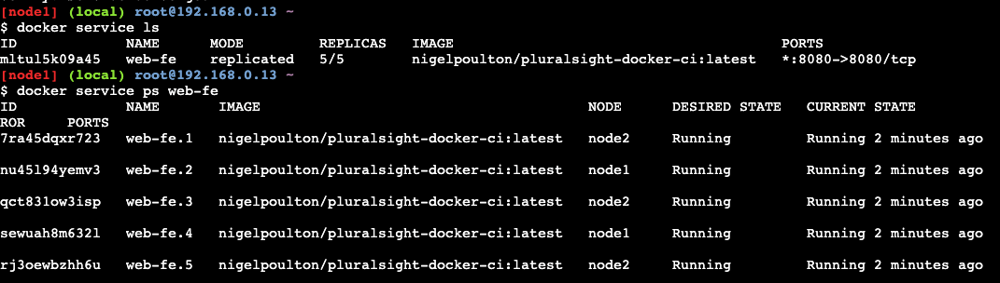
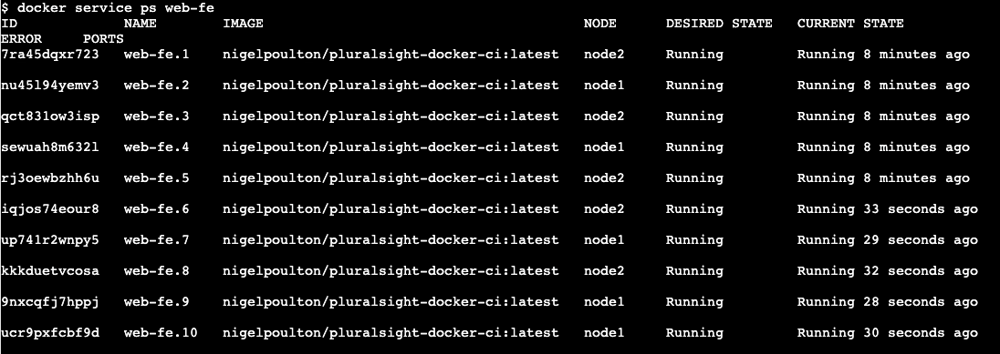

## Overview

Services are containers in production.

Services allow you to specify most of the familiar container options, such as name, port mappings, and images. But they also add important cloud-native features, such as *desired state* and automatic reconciliation. The **orchestrator** keeps the desired state defined in a service.

The steps when creating a service process in swarm mode are:

Docker API > orchestrator > allocator > dispatcher > scheduler

A dispatcher determines on which node a task is scheduled.

*Placement Preference* is used to place services evenly on appropriate nodes in a Swarm cluster.


## Creating Swarm Services

There are two methods for creating services:

- Imperatively on the command line with `docker service create`.
- Declaratively with a [stack file](./../docker-stacks/).

Here's the command-line version:

`docker service create --name <service-name> -p 8080:8080 --replicas 5 <image-name:tag>`

To see all the services running on a Swarm, use:

`docker service ls`

This output also shows you the number of replicas.

To see all the service replicas and their respective state, use:

`docker service ps <service-name>`



For more detailed information about a service, use:

`docker service inspect <service-name>`

Add the `--pretty` flag to limit the output to the most important information.

### Replicated vs Global Services

The default replication mode of a service is `replicated`. This deploys a desired number of replicas and distributes them as evenly as possible across the cluster.

The other mode is global, which runs a single replica on every node in the swarm:

`docker service create ... --mode global`

### Ingress vs Host Mode

This mode of publishing a port on every node in the swarm - even nodes not running service replicas - is called *ingress mode* and is the default.

`docker service create --name <service-name> --network <network-name> -p 80:80 --replicas 12 <image:tag>`

With *ingress mode*, every mode gets a mapping and can therefore redirect your request to a node that's running the service.

The alternative mode is *host mode*, which only publishes the service on Swarm nodes running replicas. You need to use this verbose format for specifying a `host` mode:

`docker service create --name <service-name> --network <network-name> --publish published=80,target=80,mode=host --replicas 12 <image-name:tag>`

## Managing Services

### Scaling a Service

To scale a service, use:

`docker service scale <service-name>`

Running `docker service ps` should show the replicas have been created and are distributed evenly:



### Removing a Service

To remove a service, use:

`docker service rm <service-name>`

Be careful, as you won't be asked to confirm your action!

## Making Rolling Updates

Use the following command to run a staged or rolling update:

`docker service update --image <image-name:tag> --update-parallelism 2 --update-delay 20s <service-name>`

`--update-parallelism 2` - pushes new image to 2 replicas at a time.

`--update-delay 20s` - adds a 20s cool-off period between each set of two.

Use `docker service inspect --pretty <service-name>` to get an overview.

Future updates will automatically use these settings, unless you override them as part of the `docker service update` command.

## Commands for Services

To add a placement preference: `docker service update --placement-pref-add`

To add or update a mount on an existing service: `docker service update --mount-add`

To remove a published port: `docker service update --publish-rm`

To publish container port(s) on an existing service: `--publish-add`

To set minimum and maximum memory: `--memory 4GB --memory-reservation 2GB`

## Troubleshooting Services

To view the swarm service logs, use:

`docker service logs <service-name>`

By default, Docker nodes configure services to use the `json-file` log driver. Other log drivers include:

- journald
- syslog
- splunk
- gelf

This snippet shows a Docker host configured to use syslog:

``` json
{
    "log-driver": "syslog"
}
```

You can force individual services to use a different driver by passing the `--log-driver` and `--log-opts` flags to the `docker service create` command.

You can:

- Follow the logs `--follow`
- Tail the logs `--tail`
- Get extra details `--details`


