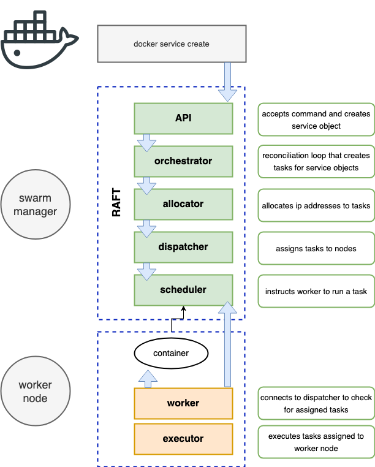
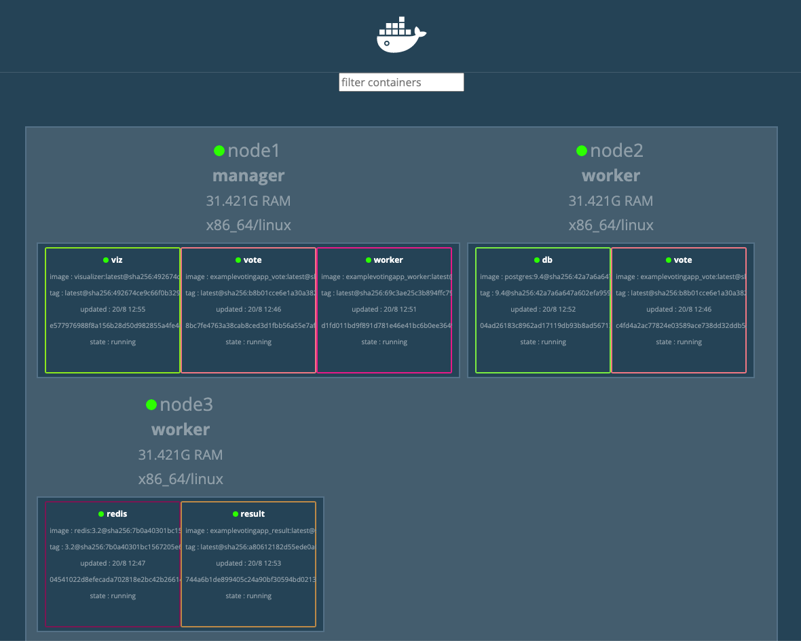

## Overview

Services are containers in production.

Services allow you to specify most of the familiar container options, such as name, port mappings, and images. But they also add important cloud-native features, such as *desired state* and automatic reconciliation. The **orchestrator** keeps the desired state defined in a service.

Services automatically replace tasks if they fail a healthcheck.

A task is the atomic unit of scheduling with a swarm. When you declare a desired service state by creating or updating a service, the orchestrator achieves the desired state by scheduling tasks. For instance, if you define a service that instructs the orchestrator to keep three instances of a container running at all times, the orchestrator responds by creating three tasks. Each task is a slow that the scheduler fills by spinning up a container.

The steps when creating a service process in swarm mode are:

Docker API > Orchestrator > Allocator > Dispatcher > Scheduler

- **Orchestrator** passes a task to its corresponding node using the HTTP request/response protocol.
- **Allocator** allocates IP addresses to tasks.
- **Dispatcher** determines on which node a task is scheduled.
- **Scheduler** instructs a worker to run a task.



## Creating Swarm Services

Services can only be created from a manager node.

There are two methods for creating services:

- Imperatively on the command line with `docker service create`.
- Declaratively with a [stack file](./../docker-stacks/).

Here's the command-line version:

`docker service create --name <service-name> -p 8080:8080 --replicas 5 <image-name:tag>`

You can specify **constraints** to limit where a service can run. For example, this service can only run on worker nodes:

`docker service create -p 8000:80 --constraint node.role=worker nginx`

To see all the services running on a Swarm, use:

`docker service ls`

This output also shows you the number of replicas.

To see all the service replicas and their respective state, use:

`docker service ps <service-name>`


For more detailed information about a service, use:

`docker service inspect <service-name>`

Add the `--pretty` flag to limit the output to the most important information.

### Attaching a Service to a Network

`docker service create <service-name> --network <network-name> <image-name>`

You can also attach the service to multiple networks:

`docker service create <service-name> --network <network1-name> --network <network2-name> <image-name>`

### Replicated vs Global Services

The default replication mode of a service is `replicated`. This deploys a desired number of replicas and distributes them as evenly as possible across the cluster.

The other mode is global, which runs a single replica on every node in the swarm:

`docker service create ... --mode global`

### Ingress vs Host Mode

This mode of publishing a port on every node in the swarm - even nodes not running service replicas - is called *ingress mode* and is the default.

`docker service create --name <service-name> --network <network-name> -p 80:80 --replicas 12 <image:tag>`

With *ingress mode*, every mode gets a mapping and can therefore redirect your request to a node that's running the service.

The alternative mode is *host mode*, which only publishes the service on Swarm nodes running replicas. You need to use this verbose format for specifying a `host` mode:

`docker service create --name <service-name> --network <network-name> --publish published=80,target=80,mode=host --replicas 12 <image-name:tag>`

## Managing Services

### Placement Preferences

*Placement Preference* is used to place services evenly on appropriate nodes in a Swarm cluster. For example, you could spread the service across nodes with a specific label:

```sh
docker service create \
  --replicas 9 \
  --name redis_2 \
  --placement-pref 'spread=node.labels.datacenter' \
  redis:3.0.6
```
### Placement Constraints

*Placement Constraints* limits the nodes a service can run on. For example, only workers. For example:

``` sh
docker service create \
  --name my-nginx \
  --replicas 5 \
  --constraint node.labels.region==east \
  nginx
```

To add or remove a contraint, you can use:

``` sh
docker service update --constraint-add <service-name>

docker service update --constraint-rm <service-name>
```

### Scaling a Service

To scale a service, use:

`docker service scale <service-name>=<number>`

For example:

`docker service scale frontend=5`

You can also use the `docker service update` command. For example:

`docker service update --replicas=5 frontend`

And it's possible to scale multiple services with the same command:

`docker service scale backend=3 frontend=5`


Running `docker service ps` should show the replicas have been created and are distributed evenly:


### Updating a Service

To update the image:

`docker service update --image <new-image-name> <service-name>`

To add an environment variable:

`docker service update --env-add <ENV-NAME>=<env-value> <service-name>`

To update a port, you first need to remove the old one:

`docker service update --publish-rm 8080 --publish-add 8081 <service-name>`

If you've recently added some new nodes to your Swarm and want to distribute your services more evenly, here's a nifty command:

`docker service update --force <service-name>`

### Removing a Service

To remove a service, use:

`docker service rm <service-name>`

Be careful, as you won't be asked to confirm your action!

## Making Rolling Updates

Use the following command to run a staged or rolling update:

`docker service update --image <image-name:tag> --update-parallelism 2 --update-delay 20s <service-name>`

`--update-parallelism 2` - pushes new image to 2 replicas at a time.

`--update-delay 20s` - adds a 20s cool-off period between each set of two.

Use `docker service inspect --pretty <service-name>` to get an overview.

Future updates will automatically use these settings, unless you override them as part of the `docker service update` command.

### Rolling Back a Service

To roll back to a previous version of the service, use:

`docker service update --rollback <service-name>`

For example, this would undo a previous `scale` command.

## Additional Commands for Services

To add a placement preference: `docker service update --placement-pref-add`

Placement preferences are ignored if a service is a `global` type.

To add or update a mount on an existing service: `docker service update --mount-add`

### Managing Memory

Docker can enforce hard memory limits, which allow the container to use no more than a given amount of user or system memory, or soft limits, which allow the container to use as much memory as it needs unless certain conditions are met.

- `--memory` - the maximum amount of memory the container can use.
- `--memory-reservation`  - allows you to specify a soft limit smaller than `--memory` which is activated when Docker detects contention or low memory on the host machine. Because it is a soft limit, it doesn't guarantee that the container won't exceed the limit.
- `--memory-swap` - a modifier flag that only has meaning if `--memory` is also set. Using swap allows the container to write excess memory requirements to disk when the container has exhausted all the RAM available to it.

## Load Balancing Services

When services are created in a Docker Swarm cluster, they are automatically assigned a Virtual IP (VIP) that is part of the service's network. The VIP is returned when resolving the service's name.

Traffic to the VIP is automatically sent to all healthy tasks of that service across the overlay network. This approach avoids any client-side load balancing because only a single IP is returned to the client. Docker takes care of the routing and distributes the traffic equally across the healthy service tasks.

When using this routing mesh, there's no guarantee on which Docker node is servicing client requests.

## Troubleshooting Services

To view the swarm service logs, use:

`docker service logs <service-name>`

By default, Docker nodes configure services to use the `json-file` log driver. Other log drivers include:

- journald
- syslog
- splunk
- gelf

This snippet shows a Docker host configured to use syslog:

``` json
{
    "log-driver": "syslog"
}
```

You can force individual services to use a different driver by passing the `--log-driver` and `--log-opts` flags to the `docker service create` command.

You can:

- Follow the logs `--follow`
- Tail the logs `--tail`
- Get extra details `--details`


To view a list of historical tasks for a service, use:

`docker service ps <service-name>`

## Example of Using Services Together

This example is from Bret Fisher's excellent *Docker Mastery* course. The aim is to create this app architecture with services:


Here are the commands to create it:

``` sh

docker network create frontend -d overlay

docker network create backend -d overlay

docker service create --name vote --network frontend -p 80:80 --replicas 2 bretfisher/examplevotingapp_vote

docker service create --name redis --network frontend redis:3.2

docker service create --name worker --network frontend --network backend bretfisher/examplevotingapp_worker

docker service create --name db --network backend -e POSTGRES_HOST_AUTH_METHOD=trust --mount type=volume,source=db-data,target=/var/lib/postgresql/data postgres:9.4

docker service create --name result -p 5001:80 --network backend bretfisher/examplevotingapp_result

```

Bret also shares a mightily useful Docker Visualizer image so you can see what you've created. You need to run it as a service on a Swarm Manager. I don't think it'll work on a VM, as you need access to the Docker socket. I used it on [Docker Playground](https://www.play-with-docker-com).

Here's the command:

``` sh
docker service create \
    --name=viz \
    --publish=8080:8080/tcp \
    --constraint=node.role==manager \
    --mount=type=bind,src=/var/run/docker.sock,dst=/var/run/docker.sock \
    bretfisher/visualizer
```

And here's what the Visualizer looks like:



Nice!

To avoid having to type very looooong service commands, you can [use a Stack](./../docker-stacks/) instead.


